 # DevOps Enterprise Summit 2021

## Takeaways

* [Workshop - Designing with UX in Mind](https://dev.azure.com.mcas.ms/blue-infosys/Discovery/_workitems/edit/109782?McasTsid=26110)
* [Workshop - Test Driven Development/Behavioral Driven Development](https://dev.azure.com.mcas.ms/blue-infosys/Discovery/_workitems/edit/109841?McasTsid=26110)
* [Workshop - Pipeline Metrics](https://dev.azure.com.mcas.ms/blue-infosys/Discovery/_workitems/edit/109843?McasTsid=26110)
* [Workshop - Incorporating Security into Your Pipeline](https://dev.azure.com.mcas.ms/blue-infosys/Discovery/_workitems/edit/109844?McasTsid=26110)
* [Take a deeper look into OpenTelemetry](https://dev.azure.com.mcas.ms/blue-infosys/Discovery/_workitems/edit/109464?McasTsid=26110)
* [Keep track of the requirements resulting from Executive Order 14028](https://dev.azure.com.mcas.ms/blue-infosys/Discovery/_workitems/edit/109784?McasTsid=26110)
* [Managing Supply Chain Issues Blog Post](https://dev.azure.com.mcas.ms/blue-infosys/Discovery/_workitems/edit/109785?McasTsid=26110)
* We are equal or ahead of most when it comes to managing open source
* [Look at incorporating Nessus into our pipelines](https://dev.azure.com.mcas.ms/blue-infosys/Discovery/_workitems/edit/109816?McasTsid=26110)
* [Define different levels of Discovery Team support](https://dev.azure.com.mcas.ms/blue-infosys/Discovery/_workitems/edit/109840?McasTsid=26110)
* [developer productivity engineering metrics built into the pipeline library](https://dev.azure.com.mcas.ms/blue-infosys/Discovery/_workitems/edit/109913?McasTsid=26110)

## Session Notes

* [How a DevOps Mindset is Influencing Target's Culture](#how-a-devops-mindset-is-influencing-targets-culture)
* [Journey to Digitopia: The Government of Canada's Quest to Modernize Services](#journey-to-digitopia-the-government-of-canadas-quest-to-modernize-services)
* [Iterative Enterprise SRE Transformation](#iterative-enterprise-sre-transformation)
* [Interview: Kimberly Johnson and Christopher Porter on Leadership](#interview-kimberly-johnson-and-christopher-porter-on-leadership)
* [SRE From Scratch: An Enterprise Journey](#sre-from-scratch-an-enterprise-journey)
* [Embedding Security: How We Use Automation to Reduce Time and Effort for Cisco Developers to Secure their Products](#embedding-security-how-we-use-automation-to-reduce-time-and-effort-for-cisco-developers-to-secure-their-products)
* [A Layered Approach to Progressive Delivery](#a-layered-approach-to-progressive-delivery)
* [Thinking Upstream About White House Cybersecurity Executive Order 14028](#thinking-upstream-about-white-house-cybersecurity-executive-order-14028)
* [Saving the Software Supply Chain: Critical Trends and 5 Must-Dos for DevOps](#saving-the-software-supply-chain-critical-trends-and-5-must-dos-for-devops)
* [Improving the Developer Experience at the National Security Agency](#improving-the-developer-experience-at-the-national-security-agency)
* [Continuous Delivery at Suncor's Digital Bay; Mining Maintenance meets DevOps](#continuous-delivery-at-suncors-digital-bay-mining-maintenance-meets-devops)
* [How Google SRE and Developers Work Together](#how-google-sre-and-developers-work-together)
* [How Discover Financial Services Puts Engineering "Craftsmanship" at the Center of Our Digital Transformation](#how-discover-financial-services-puts-engineering-craftsmanship-at-the-center-of-our-digital-transformation)
* [The Four Characteristics of Structure Needed to Get Great Dynamics](#the-four-characteristics-of-structure-needed-to-get-great-dynamics)

### How a DevOps Mindset is Influencing Target's Culture

tech.target.com

Completely redid the way ther deliver fresh food merchandising and combined people across silos and empowered them to solve problem. Put them in a common space and told them:

> We want you to communicate person to person, not powerpoint to powerpoint

They were in trouble with their inability to be in stock on high quality perishables and was raising the question of whether or not they should remain in the market.

* Clairty from leaders on the goal and they got out of the way
* Merchants, products, engineering, data analysts co-located
* Used short sprints, fast feedback loops, kanban boards, and retros
* Mapped out the value stream (key milestones, KPIs and Activities)
* Small, empowered, cross-discipline team

*Guardrail: Drive profit without sacrificing Sales in Fresh*

***feed was interrupted for some reason - missed a bunch of this talk***

Target implemented a culture framework to remind themselves why they are doing what they are doing

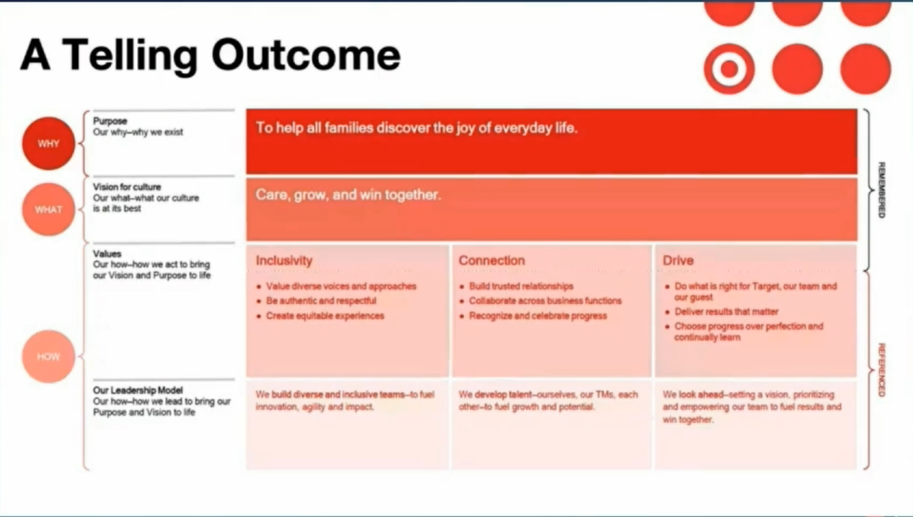

### Journey to Digitopia: The Government of Canada's Quest to Modernize Services

The government of Canada already had a vision to go digital as much as possible pre-COVID. They wanted to eliminate phone calls and forms and make everything digital. Make the data needed available to anyone at any time on any device.

> The ultimate frictionless experience is what we should be striving for

### Iterative Enterprise SRE Transformation

Need to look more into OpenTelemetry standards

SLI - service level indicator

The proportion of successful requests, as measured from the load balancer metrics

Any HTTP status < 500 is considered successful

The proportion of sufficiently fast request, as measured from the load balancer metrics

"sufficiently fast" is defined as:
< 500ms 

SLO - service level objective

### Interview: Kimberly Johnson and Christopher Porter on Leadership

> Psychological safety needs to underpin everything

Need to be willing to learn, take risks, and not be afraid to fail.

> there should be no humiliation or shame in making mistakes

### SRE From Scratch: An Enterprise Journey

Started with a lack of measurment culture - sounds like us

Moved from open source pipeline tools to enterprise tools, but the developers had more complaints than ever - there were a lot of stability issues with the new platform.

They found that a lot of different teams worked on their pipelines in a lot of different ways. Ways that made it hard to make the platform stable.

Ended up deciding to introduce the SRE role.

Adoption phases:
1. Assess
1. Define
1. Incubate
1. Adopt

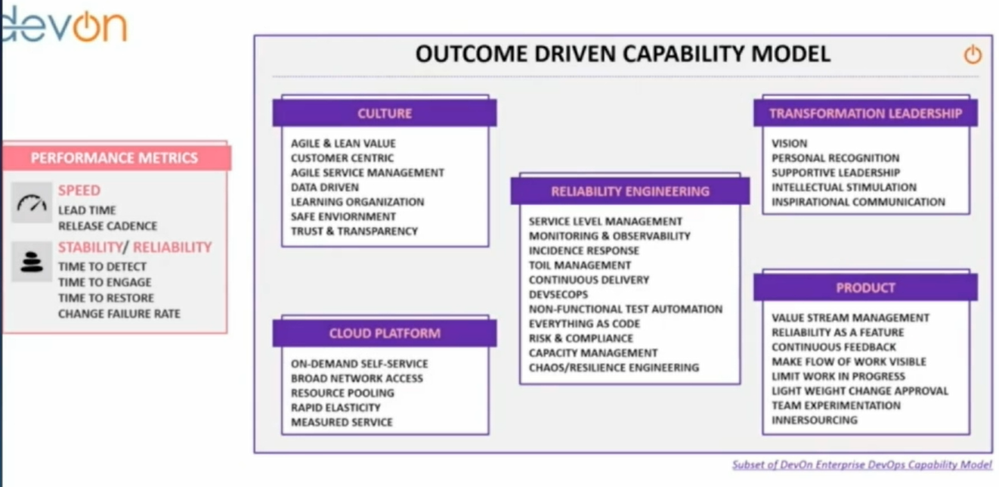

Reactive to Proactive in 6 months. Concentrated on Reliability Engineering, but needs to be expanded to include more culture.

By better managing incidents, they found they had more problems in their digital estate than initially expected.

### Embedding Security: How We Use Automation to Reduce Time and Effort for Cisco Developers to Secure their Products

Delivered by a team like the Discovery Team - they are the Developer Experience Team

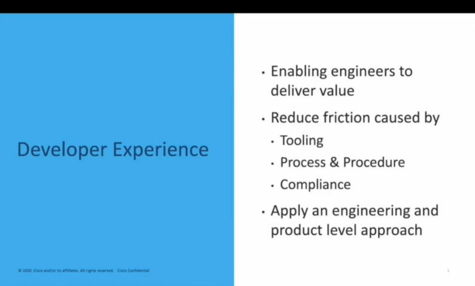

Their team members span different areas of the company and are dedicated to this team. The differing backgrounds allow for better work in automating stuff that comes around.

Compliance Obligations:

1. Ship only the software you need

    Don't put anything in your application that isn't needed

1. Keep your software up-to-date

    need to be able to deliver updates when any component needs to be updated

1. Open source software compliance

    licenses - creates obligations for the developers and distributors

The software bill of materials is going to be key to delivering on the compliance obligations. This needs to be a complete inventory of ALL components. This includes the transitive dependencies.

When starting containers they ran into some compliance challenges. Most notably is the lack of container support in existing tooling. Additionally the container ecosystem was a challenge because the content might be unknown, might include unnecessary software, and contained out of date software.

They use a suite of products from Anchore -

* anchore enterprise - https://anchore.com/enterprise
* syft - https://github.com/anchore/syft - generates SBOMs from images
* grype - https://github.com/anchore/grype - takes an SBOM and provides vulnerability analysis
* various integrations - https://anchore.com/integration

Anchore enterprise has a rich policy engine that can enforce container best practices

Helios - an in-house restful service for cataloging and reporting on releases

Minerva - an in-hosue service for vulnerability trending and analysis
    * automates ticket creation for remediation of vulnerabilities

They build a jenkins plugin to parse results from Anchore - wrapper around https://plugins.jenkins.io/anchore-container-scanner

Interesting talk which tells me we are on the right track. I feel like Cisco is ahead of us on ensuring compliance, but have done more work than I think might be nessecary to ensure SBOMs and vulnerabilities are monitored. I feel like they could have eliminated a lot of custom work by using something like Black Duck. A lot of what they described is custom coding around functionality which comes out of the box with Black Duck.

### A Layered Approach to Progressive Delivery

Technical issues with this talk. I missed a majority of it. Need to go back and watch the recording.

### Thinking Upstream About White House Cybersecurity Executive Order 14028

In May of 2021 the White House released the EO with a series of details directives on improving the nation's cynbersecurity

This is the government's response to the resent set of high-profile attackes.

Potentially large impacts to organizations using open soruce to develop applications

Requirements are evolving.

This is geared to be the standard which all software will be written moving forward, not just in the United States, but internationally

One of the critical areas are around the software supply chain security.

Instructed NIST to crowdsource the standards and best practices around software and supply chain activities - within 90 days - <https://www.nist.gov/itl/executive-order-improving-nations-cybersecurity>

Instructed the NTIA to publish the minimum requirements for the SBOM - within 60 days - <https://www.ntia.doc.gov/report/2021/minimum-elements-software-bill-materials-sbom>

If you are building open source, how do you:

1. track and maintain an accurate software bill of materials?

1. attest to the integrity and provenance of open source software?

1. attest to conformity with secure software development practices?

This is a tricky problem.

Interestingly, only about half of the maintainers are getting paid for their open source work. And only 25% of the maintainers earn more than $1k per year for their maintenance work.

Something doesn't add up here. The government wants us to attest to integrity and conformity, but the open source maintainers are not getting paid to ensure the tedious and laborious standards are being met.

How are we going to take an upstream approach to answering the required questions about the open source software? There are three main questions we need to go upstream for:

1. How do I produce and maintain an accurate SBOM for my projects? Black Duck

1. How can I feel confident attesting to the integrity and provenance of open soruce software components? No idea

1. How can I feel confident attesting to how open source components conform to secure software development practices? No idea

What happens if we start paying the open source maintainers to get them to help answer the above questions?

### Saving the Software Supply Chain: Critical Trends and 5 Must-Dos for DevOps

Why do we need to focus on the software supply chain?

* vulnerable code
* inside attacks
* typo squatting
* malware injection
* dependency hijacking
* software tool attack
* patch site attack

Growing container adoption shows greater security challenges

Must Do #1 - Create Specialized Processes that Understand Containers

We need to make sure all of our tools are container aware and are able to do the same level of operation as if it wasn't in a container.

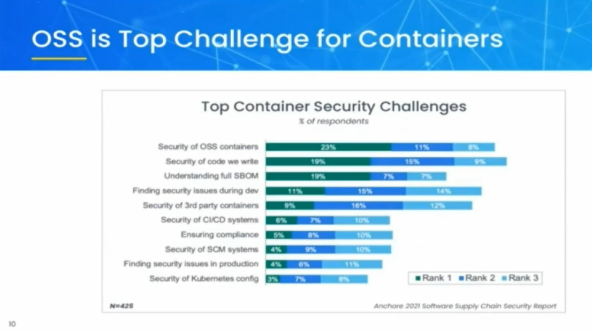

Must Do #2 - Pay Closer Attention to Software Not Developed In-House

This is a repeating topic from the Synopsys Flight conference.

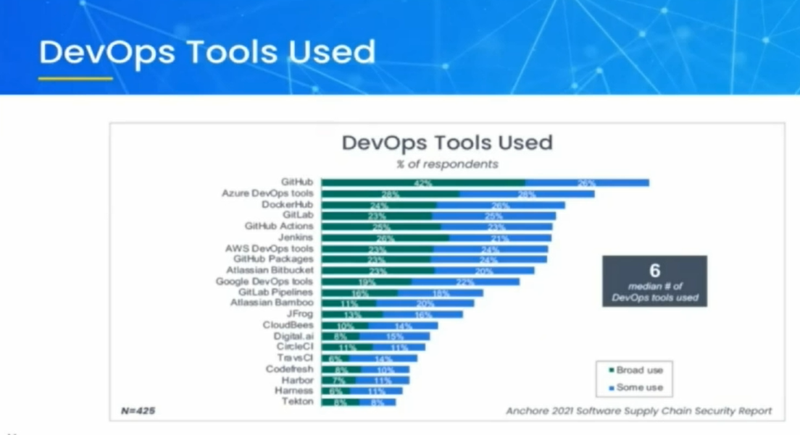

Must Do #3 - Need an Approach for Security and Compliance that Spans Diverse Tools

Different tools can have their own security tooling, we need to find a way to set a standard set of policies across the different sets of tools we are using. This will help us ensure we are doing things to a certain set of standard security.

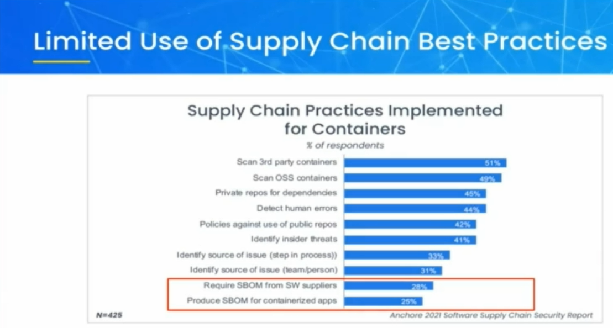

Must Do #4 - Get on a path to ingest and produce SBOMs

Must Do #5 - Shift-left for security automation to find issues closer to when they are introduced

### Improving the Developer Experience at the National Security Agency

This group sounds a lot like the Discovery team, but there are 100 of them. Only 3 of us.

> There is no They. We are They.

### Continuous Delivery at Suncor's Digital Bay; Mining Maintenance meets DevOps

Suncor is Canada's largest energy company.

Defined some pieces which are important to them:
* Innovation
    * UX
    * operations
* Technology
    * emerging tech
    * rapid pace of change
* Mindset
    * product
* Great place to work
    * buiding trust
    * safety
* Time-to-Value
    * realizing value ASAP
* Cost focus
* Customer-centricity

### How Google SRE and Developers Work Together

Interesting, but because we don't have SRE roles, this isn't a problem we face. Could be used as a model for Discovery Team engagments

1. Discovery Love - dev teams do the work, we help - building relationships

    This is the default engagement type in the absence of a specific service engagement type. Setup some Discovery Team office hours or fixed-time consulting on projects to get advice and technical design feedback.

1. Assisted Engagement

    The Discovery Team provides strategic, proactive, project-focused consultancy. There is a dedicated Discovery Team point of contact.

1. Full Support - expensive and highest commitment. Significant effort from both sides

Each level of support would have specific gates to entry. We would have to define what those gates are and need to include definition of work and completion criteria. The engagement process and criteria should evolve continually.

### How Discover Financial Services Puts Engineering "Craftsmanship" at the Center of Our Digital Transformation

Implemented the Discovery Dojo - Get your Mojo! These are hands-on, 4 weeks, fully immersive, with a coach. Can have focus areas in the Dojo. Some examples of topics -

* Test-Driven Development
* Behavioral-Driven Development
* Small features and right size small stories
* Full CI/CD pipeline metrics, security & SRE
* Campaigns, UX optimizations, technology modernization

Metrics they are using to determine performance -

1. Lead Time
1. Predicatable Delivery
1. Deployment Ferquency
1. Change Failure Rate
1. Mean Time to Restore

### The Art of Platform Engineering

Anti-patterns:

* DevOps is not a new silo that sits between dev and ops
* It's all or nothing - we can't configure continuous delivery through QA, but not production. That doesn't solve anything

DevOps Framework - the 5 C's
* Continuous Integration
* Continuous Delivery
* Continuous Testing
* Continuous Monitoring/Feedback
* Continuous Compliance

DevOps STARR
* Simplicity
* Traceability
* Accountability
* Repeatability
* Reliability

A single unified path to production supporting all technologies and deployment endpoints

### Why the Dora Metrics and Feature Management are a Brilliant Combination

Ben says this session is really good. I should go back and watch this.

### Governance, Compliance, and Risk in the SDLC Can Be A Fun Event

> Our mission is to provide one cohesive ecosystem of developer tools and services to improve the experience of our product teams in Enterprise Technology.

Product Teams around: GitOps, Security, Open Source

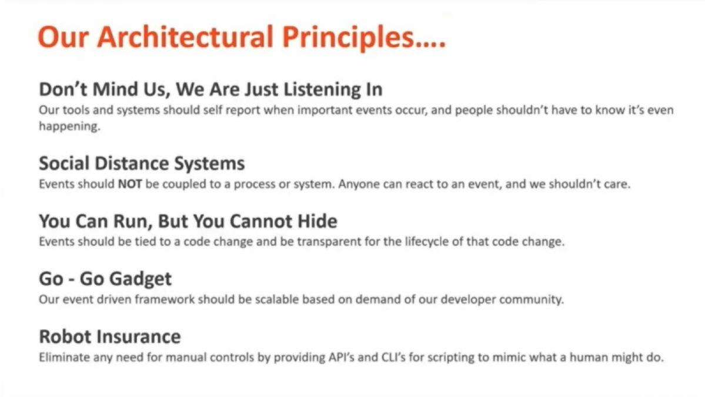

Uses AWS. Including stuff like EventBridge - event driven architecture, elasticsearch - tie events together and get some advanced analytics

Hooked into webhooks for git pushes to start tracking metrics. Leveraged some of the GitOps tooling to track times between change and deployment. This gives me an idea - building a value stream is a PITA, but what if we could automate it and show real metrics around each step of the process? That might be a good goal for a GitOps product team. We would want to make sure we are keeping a history of the metrics so we can see trending.

They build custom CLIs for common commands to standardize the format of the data. That is an interesting idea. If we wanted to ensure git commit comments have a certain format, we could use a custom command line interface to enforce it. Would that mean there are custom extensions for VSCode/IntelliJ/Eclipse?

### ENSUCKLOPEDIA Of DevUps

Fun, but not much to take away from this talk

### DevSecOps - The Broken or Blurred Lines of Defense

Minimum viable security

1. How do we prove we are safe?
2. How do we demonstrate we are secure?
3. How do we do both?

Need to understand how we change from subjective to objective and verifiable. There should be machine generated evidence with no human involvement. But it needs to include verification that the data is correct.

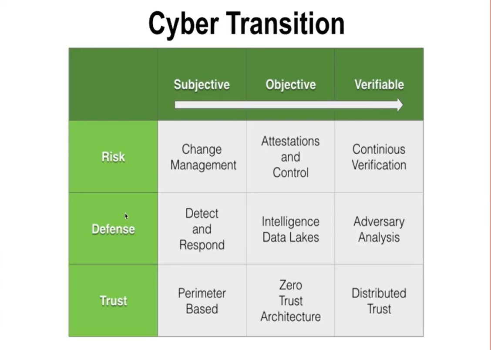

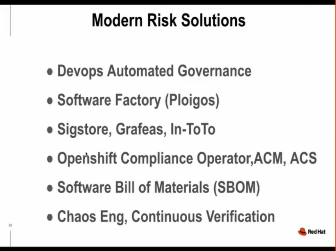

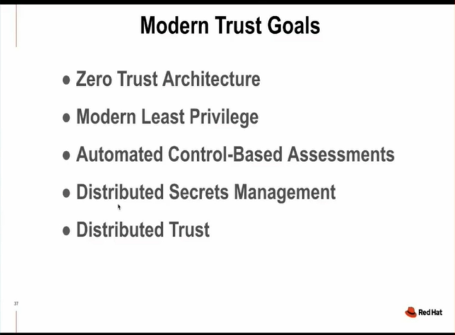

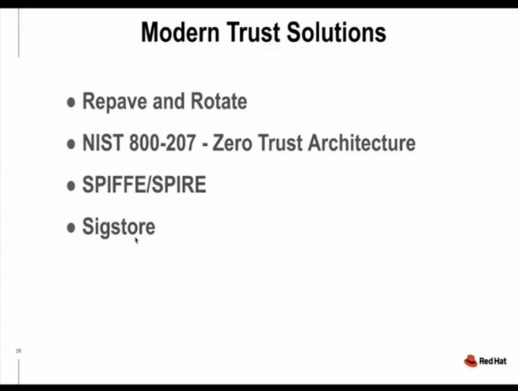

### Driving a Tech-led Reimagination of eBay Through DevOps

They really tried to increase their velocity - moving away from waterfall to a more agile approach

1. Deliver short term wins and long term capabilities
1. Re-architect critical areas like view item and mobile
1. Drive improvments in
    1. developer productivity
    1. software delivery
    1. instrumentation and monitoring
1. Focus on select
    1. pilot domains
    1. pilot applications
    1. platform tracks

What kind of metrics can we build into the pipeline library that will allow people to get stuff for free? What can we drive for innovations from that data?

What they did:
* DORA metrics for every app
* Focused on removing bottlenecks
* Reduced build, startup and PR validation times
* Invested heavily in Staging environment
* Automated upgrades, testing, deployment, Site Speed
* Streamlined team processes, code reviews, "Partner Signoffs"
* Moved from monthly to weekly mobile releases

For reference:

> Four Key DORA Metrics
> 1) Deployment Frequency. Deployment frequency looks at how often an organisation deploys code to production or releases to end-users.
> 2) Mean Lead Time for Changes.
> 3) Change Failure Rate.
> 4) Time to Recovery.

Culture and behavior changed as a result of these changes. Teams are excited and having fun

### Building Confidence in Your SRE Team

1. Automate

    Worked with Brent to document procedures for production deployment

    Used a junior engineer to execute the directions with Brent supervision

    Used a third engineer to update documentation while the junior engineer executed the directions

    Over time, no errors happened.

    Added automation

1. Toil

    As you automate pieces of your toil it frees up time for you to automate more of your toil

    * deployments
    * key rotation
    * self healing
    * certificates
    * patches
    * release notes
    * testing

1. Be Selective

    Encourages standards and economy of scale and to fortify the team's strength

    Define a set of criteria for taking on more work

### Putting the Ops in DevOps - An Infrastructure Story

I feel bad about this, but this talk is a snoozer. It's all about ops and difficult for me to connect with.

### "She's Not Dead Yet, Jim" Vulnerability and Retrospectives in Emergency Medicine

> Incidents are unplanned investments in our systems

* Debriefs - immediately after an event

    Anyone who was in the room is invited. Generally 5-10 minutes. 15 minutes max

    Starts with a description of the structure of the debrief. Focus on self performance, not others. Lead with a vulnerability and explain a mistake you've made. Starting with an issue allows for psychological safety for the rest of the team. If the leader can start with a mistake, then it is ok for me to share.

    Ask for what we can do better? If you can change 1% to better the outcome, what would that be?

    After that, use the opportunity to level up the team - allow another team member to lead the discussion. Make sure they are aware before you nominate them.

    If there is something that can be deemed critical of someone's performance, talk with them individually before doing the debrief - hey, I saw this and I wanted to get your thoughts on what happened. This allows them to gather their thoughts and not be defensive.

    When dealing with self blame, we need to be mindful of how that will make them feel and push for how do we improve. Don't focus on the shame. You will make many mistakes, just like me. We can keep the mistakes with a view of perspective by looking at time. In 5 days, 5 weeks, 5 months, will this matter? Instead, we can focus on improvements.

    Mistakes are not a reflection of lack of competence or skill. Mistakes are more common than you think - competent people make mistakes when confronted with interruptions and context switches.

    Separate action items from the debrief. Focus on learning, not actions.

Language can change how we look at psychological safety. Instead of peer review, case review. Or in our world - instead of peer review, code review. Instead of asking why something happened, ask for someone to help you understand what happened. Instead of looking at what you should have done, focus on what you saw and caused you to do what you did. Instead of calling it a postmortem, which is very negative, call it a retrospective.

Wellness and mental health cause better quality of life, better retention, and happier physicians.

### How OpenTelemetry Improves Observability and Monitoring

As we move from monoliths to microservices, monitoring becomes much more challenging, but also more critical. We need to be able to quickly find the source of issues as they appear.

Latency is the new downtime

Monitoring needs to evolve into obserability. Finding the unexpected and explain why it happened quickly.

The first step in making the application observable is telemetry. Need to build a strategy, then instrument, and then configure observability last.

*Observability* is the measure of how wellinternal states of a system can be inferred rorm knowledge of its external outputs.

*Data sources* all support the notion of resources
    * *traces* tack the progression of a single request
    * *metrics* a measure about a service, captured at runtime
    * *logs* captured from the application

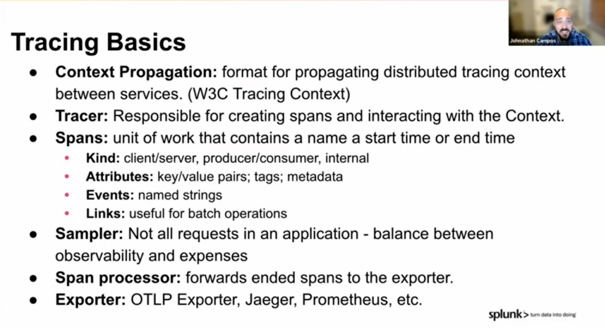

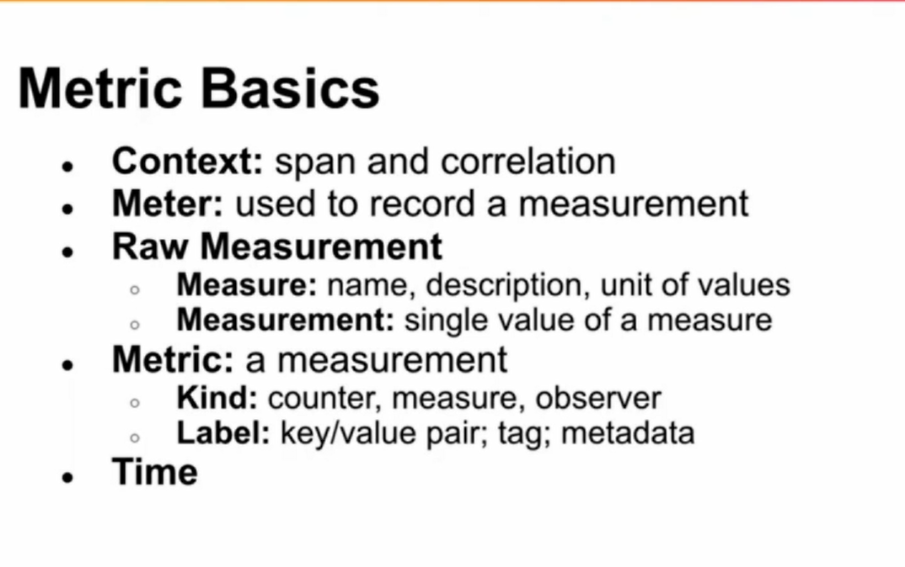

OpenTelemetry is an open source projects to help collect telemetry data. It is becoming the new standard for observability. It is vendor neutral.

Includes a spec, instrumentation library and a collector.

The largest reason it has been so widely adopted is because of the time-to-value. There are a lot of things built into it that make it easy to use.

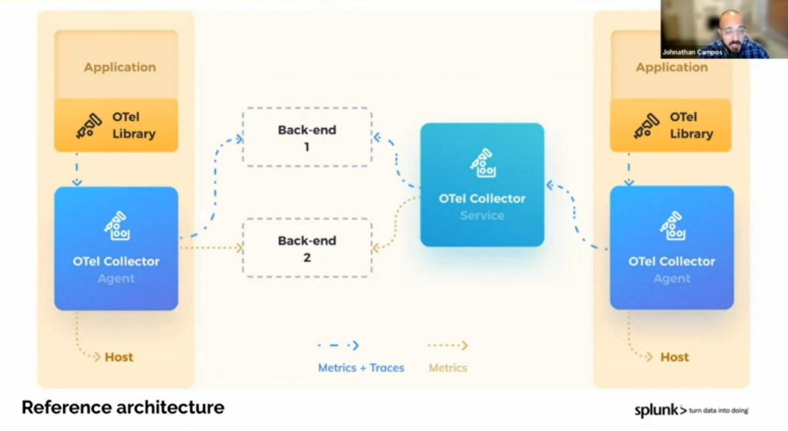

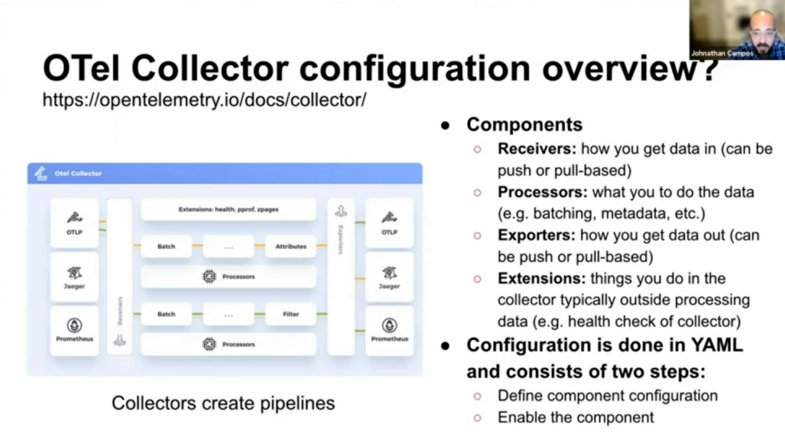

Get this presentation - there are some links on slide 29 that are good for getting started with OpenTelemetry.

### Tales from the Branches - Why GitOps Matters for Your Business Success

Principles of gitops

1. The entire system is described declaratively
1. The canonical desired system state is versioned in git
1. Approved changes can be automatically applied to the system
1. Software agents ensure correctness and alert (diffs & actions)
1. Actions are performed when the run time state, diverges from the state in git, creating a closed loop system

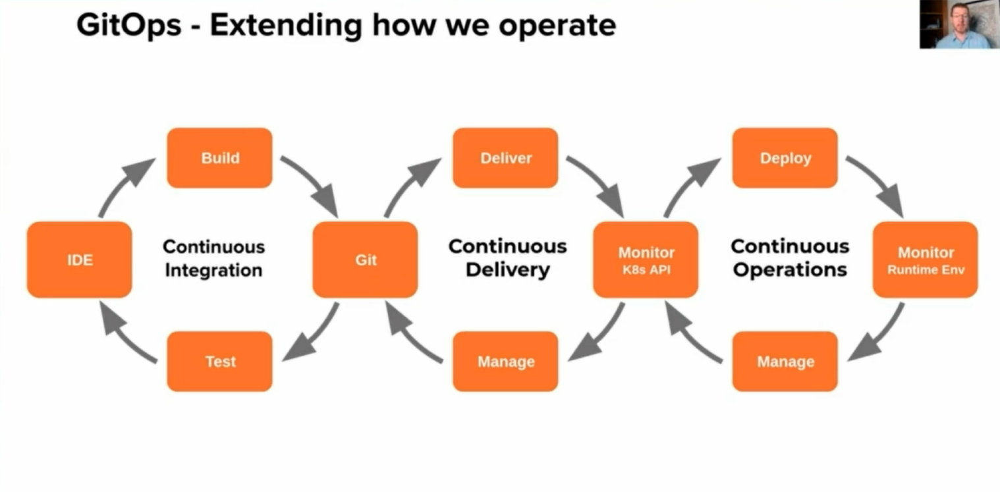

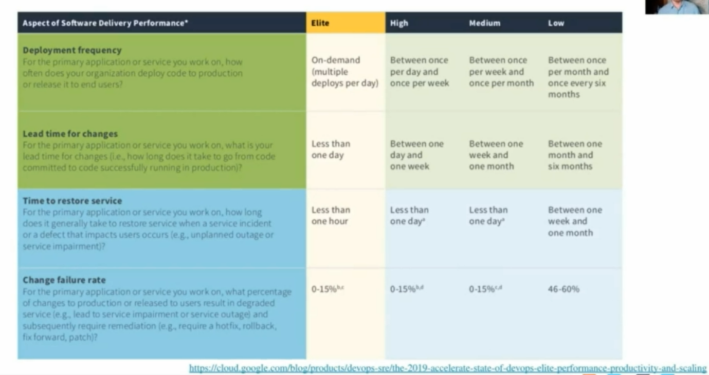

### Developer Productivity Engineering - The Next Big Thing in Software Development

Developers do a lot of different tasks and sometimes things take too long, or take too long to fix, or could have been prevented. This happens every day to 100s of developers causing decreased productivity and increased cost.

Developers tend to be like water - if there is something in the way, they will try to find a way around it. It doesn't fix the issue. Others will still have the same issue.

Software development is a creative process. It's also scientific.

Enterprise software development creates a new set of challenges.

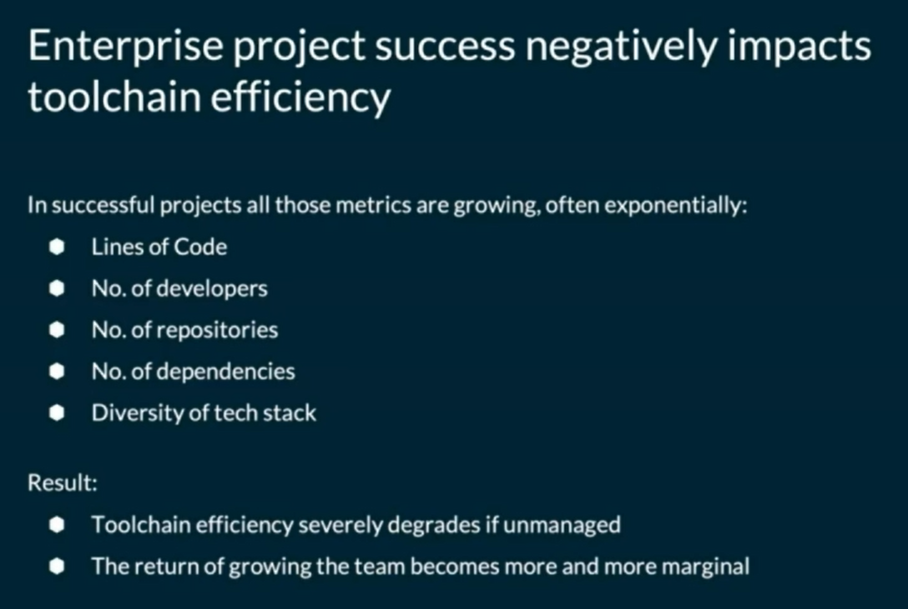

Because of these impacts, the successful software is delays and therefore unhappy developers.

The outcome for developer performance engineering - give developers hours back in their week to work on valuable solutions.

Increase productivity by increasing happiness. Low developer productivity is blocking business innovations.

> unreliable and/or slow build infrastructure represent productivity black holes that are not in scope for DevOps

We need to implement acceleration technologies and data accumulation and analysis technologies to speed up and monitor feedback loops.

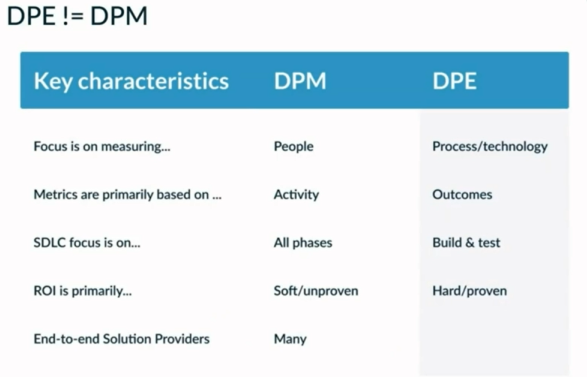

DPE = Developer Productivity Engineering

DPM = Developer Productivity Management

DPE generally focuses on the build and test cycles of the developer experience, but with containers, this can bleed into the other phases of the SDLC

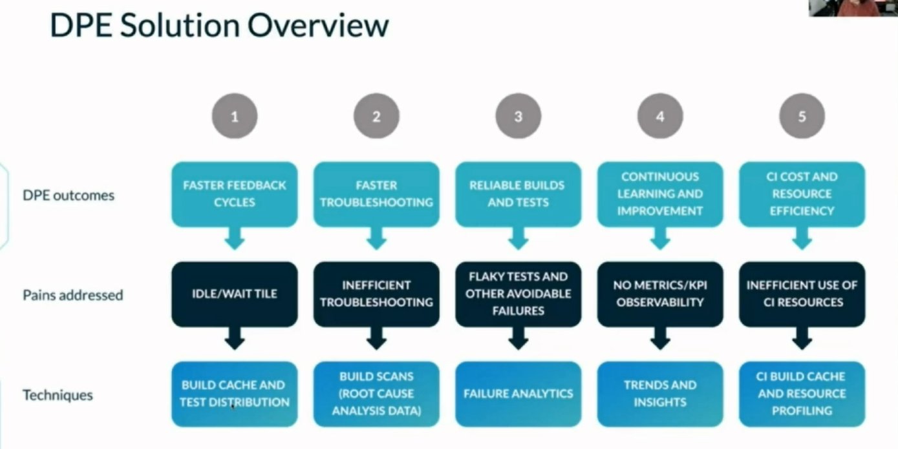

Build Caching was introduced for Java in 2017 and supports Maven and Gradle. Looks a lot like the cache that is used for building docker containers to speed up the build

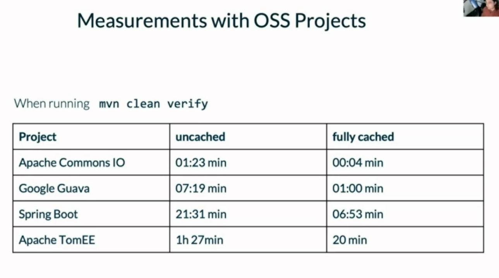

> what gets measured gets improved

So measure.

### A Radical Enterprise: Pioneering the Future of High Performance

Radical enterprises are companies that have decided to eliminate the buerocracy by eliminating the hierarchy. No bosses

